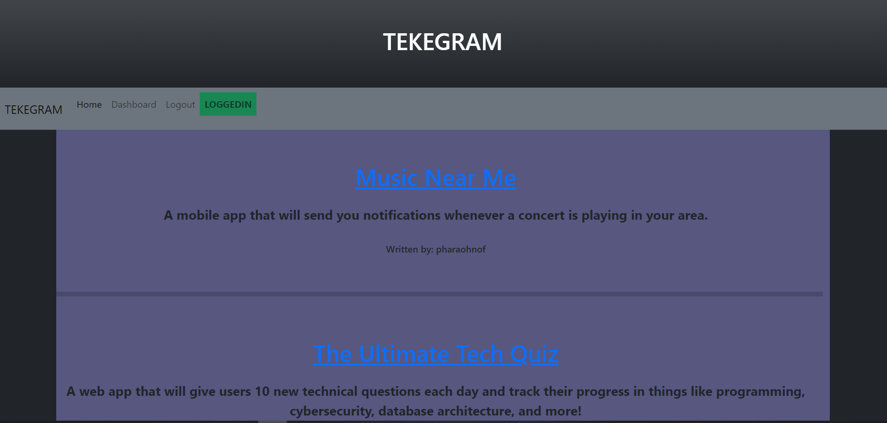

#  TEKeGRAM   

  ##  Description

***

  TEKeGram is a retro style blog post web application. The simple interface allows you to make posts on a blog like website. Each post is visible and other users can comment.

  
  
  ## Table Of Contents  

***
  * [Description](#Description)
  * [Table Of Contents](#table-of-contents)
  * [Installation](#Installation)
  * [Usage Instructions](#usage-instructions)
  * [Contribution Guidelines](#contribution-guidelines)
  * [Testing Instructions](#testing-instructions)
  * [License](#License)
  * [Questions?](#questions)

  ##  Installation

***

  ### Clone the repository: 
    git clone git@github.com:FaeroDev/tekegram.git  
      
  ### Dependencies:  
  The following dependencies are required for use:  
 - bcryptjs
 - connect-session-sequelize
 - dotenv
 - express
 - express-handlebars
 - express-session
 - mysql2
 - sequelize  
  
  ### Additional Installation Instructions:

    
  No installation is necessary to use this application. 

  ##  Usage instructions  
***

Live site is hosted at https://tekegram.herokuapp.com/  
    
    
    
  ##  Contribution Guidelines  

***
If you would like to contribute to this project, please [add me on GitHub](https://github.com/FaeroDev)   
  
    
  ##  Testing Instructions  

  ***
    
  N/A  
    
  ##  License

  ***
      
  This project is covered under the  license.  
    
  See attached [LICENSE](./LICENSE) file for details.  
    
  ##  Questions?  

  ***
  
  If you have any questions regarding this application you can reach me using the below contact information:  
  ### Contact Info  
    
  GitHub: [FaeroDev](https://github.com/FaeroDev)

  Email:  FaeroDev@gmail.com
